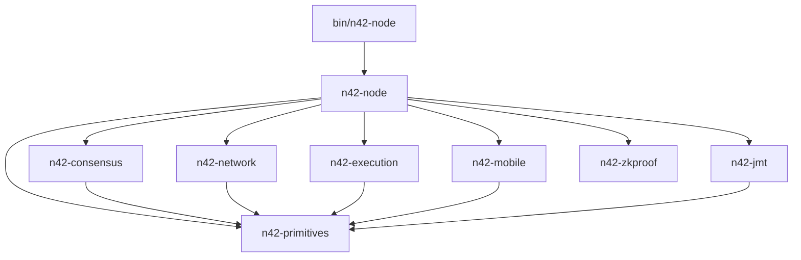

# Workspace Map

## Top-level layout

```text
n42-26/
├── bin/                 Executable entrypoints and operational tools
├── crates/              Core libraries
├── docs/                Historical devlogs and research notes
├── Docs/                Structured architecture and audit documentation
├── tests/e2e/           End-to-end integration scenarios
├── scripts/             Local launch and developer automation
├── docker/              Container support
├── mobile/              Android and iOS app shells
└── n42-data/            Runtime data, certs, state snapshots
```

## Workspace members

| Path | Type | Purpose |
|---|---|---|
| `bin/n42-node` | binary | Primary node process and bootstrap path |
| `bin/n42-mobile-sim` | binary | Mobile verifier simulator |
| `bin/n42-stress` | binary | High-throughput transaction injector |
| `bin/n42-evm-bench` | binary | EVM benchmarking utility |
| `crates/n42-primitives` | library | Shared primitive types, BLS keys, consensus messages |
| `crates/n42-chainspec` | library | Chain spec and N42 consensus config |
| `crates/n42-consensus` | library | HotStuff-2 consensus engine and validator logic |
| `crates/n42-execution` | library | EVM execution helpers, witness and state diff |
| `crates/n42-mobile` | library | Mobile protocol, packets, receipts, local verification |
| `crates/n42-mobile-ffi` | library | Android/iOS/C bindings for mobile verifier runtime |
| `crates/n42-network` | library | libp2p network service and QUIC StarHub |
| `crates/n42-node` | library | Node composition, orchestrator, RPC, persistence, rewards |
| `crates/n42-parallel-evm` | library | Optimistic parallel EVM execution engine |
| `crates/n42-jmt` | library | Blake3-based Jellyfish Merkle Tree implementation |
| `crates/n42-zkproof` | library | ZK proof scheduling, storage, prover abstraction |
| `tests/e2e` | binary/test harness | Multi-scenario end-to-end test runner |

## Layering model



## Ownership by responsibility

### Control plane

- `bin/n42-node`
- `crates/n42-node`
- `crates/n42-consensus`
- `crates/n42-network`

### Execution and state

- `crates/n42-execution`
- `crates/n42-parallel-evm`
- `crates/n42-jmt`

### Mobile verification plane

- `crates/n42-mobile`
- `crates/n42-mobile-ffi`
- `crates/n42-network/src/mobile/*`
- `crates/n42-node/src/mobile_*`

### ZK and proof plane

- `crates/n42-zkproof`
- `crates/n42-zkproof-guest`

### Operations and validation

- `bin/n42-stress`
- `bin/n42-mobile-sim`
- `tests/e2e`

## Relationship to `docs/`

The lower-case [`docs/`](/Users/jieliu/Documents/n42/n42-26/docs) directory is a chronological engineering journal. It is useful for rationale and history but hard to consume as a system reference.

This `Docs/` tree is organized around:

- architecture
- runtime data flow
- module boundaries
- operational risk

Use both together:

- `Docs/` for “what exists now”
- `docs/` for “how it evolved”
