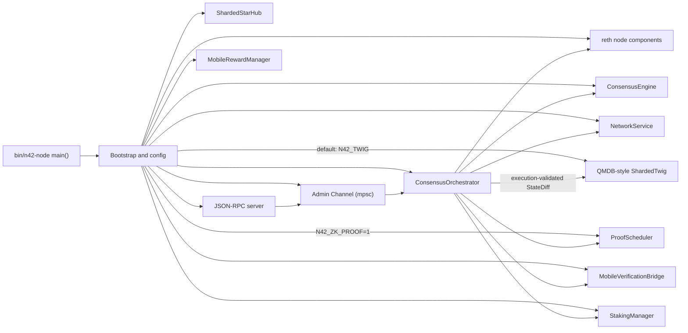
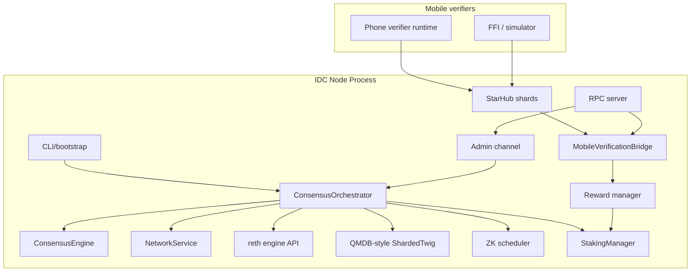

# System Architecture

## Executive summary

N42 is a high-performance blockchain node that combines:

- HotStuff-2 style BFT consensus
- reth-backed EVM execution
- a libp2p-based validator network
- a QUIC-based mobile verifier side channel
- a default QMDB-style binary twig state-proof backend
- optional asynchronous ZK proof generation

The system is intentionally split into an on-critical-path validator plane and an off-critical-path verification plane.

## Runtime composition

## Major planes

### 1. Consensus plane

Purpose:

- elect leader
- propose blocks
- collect votes and timeout certificates
- finalize commits

Primary code:

- [`crates/n42-consensus/src/`](crates/n42-consensus/src)
- [`crates/n42-node/src/orchestrator/`](crates/n42-node/src/orchestrator)

### 2. Execution plane

Purpose:

- build payloads through reth integration
- import committed blocks
- optionally generate execution witness and compact execution output
- derive state diffs for QMDB/LtHash and mobile verification

Primary code:

- [`crates/n42-execution/src/`](crates/n42-execution/src)
- [`crates/n42-node/src/payload.rs`](crates/n42-node/src/payload.rs)
- [`crates/n42-node/src/orchestrator/execution_bridge.rs`](crates/n42-node/src/orchestrator/execution_bridge.rs)

### 3. P2P validator network plane

Purpose:

- consensus message dissemination
- block announcement and direct block delivery
- transaction forwarding to leader
- state sync and peer management

Primary code:

- [`crates/n42-network/src/service.rs`](crates/n42-network/src/service.rs)
- [`crates/n42-network/src/transport.rs`](crates/n42-network/src/transport.rs)

### 4. Mobile verification plane

Purpose:

- push verification packets to phones
- collect signed receipts
- aggregate attestation state
- feed reward accounting

Primary code:

- [`crates/n42-network/src/mobile/star_hub.rs`](crates/n42-network/src/mobile/star_hub.rs)
- [`crates/n42-node/src/mobile_bridge.rs`](crates/n42-node/src/mobile_bridge.rs)
- [`crates/n42-mobile/src/`](crates/n42-mobile/src)

### 5. Proof and state proof plane

Purpose:

- maintain the QMDB-style binary twig root and proofs
- generate and store asynchronous ZK proofs
- expose proof queries via RPC

Primary code:

- [`crates/n42-twig-core/src/`](../crates/n42-twig-core/src)
- [`crates/n42-jmt/src/twig.rs`](../crates/n42-jmt/src/twig.rs)
- [`crates/n42-zkproof/src/`](../crates/n42-zkproof/src)

> **当前状态树选择**：`N42_TWIG` 未设置时默认启用 QMDB 风格的 16-shard
> binary twig；`N42_JMT=1` 是显式选择的 reserve SBMT 路径。PR #22 之后，tree
> diff 仅在 execution acceptance 后按 committed view 顺序应用。目标 follower
> commitment 规则是 QMDB root + LtHash summary；Rust 的 LtHash 与 proposal/header
> wiring 尚未完成，详见
> [`follower-validation-modes.md`](follower-validation-modes.md)，不得把该目标能力写成
> 已经上线。

### 6. Staking plane

Purpose:

- track validator stake deposits and registrations
- resolve BLS pubkey → staker EVM address for reward distribution
- manage cooldown period and pending returns

Primary code:

- [`crates/n42-node/src/staking.rs`](crates/n42-node/src/staking.rs)
- Orchestrator: `scan_committed_block()` on each block commit
- Execution bridge: staked pubkey resolution for reward address mapping

## Process-level architecture

## Critical-path versus non-critical-path work

### Critical path

- proposal creation
- proposal validation
- consensus vote and commit rounds
- block import/finalization

### Off critical path

- mobile packet dispatch
- mobile receipt aggregation
- mobile rewards
- QMDB binary twig background updates
- ZK proof generation
- many observability and persistence tasks

This split matters operationally: a failure in mobile verification should not prevent consensus progress unless the implementation incorrectly couples the two.

## Production wiring audit (2026-07-12)

Each module's end-to-end integration status: constructed in `main.rs` → events connected → RPC exposed.

| Module | Status | Activation | Key callsite |
|--------|--------|-----------|-------------|
| ConsensusEngine | ✅ Wired | always | `main.rs:948` → orchestrator select! |
| N42Consensus (reth adapter) | ✅ Wired | always | `components.rs:92` → reth node builder |
| NetworkService (GossipSub) | ✅ Wired | always | `main.rs:770` |
| StarHub + MobileBridge | ✅ Wired | always | `main.rs:815,891` → critical tasks |
| MobileRewardManager | ✅ Wired | always | `main.rs:863` → `execution_bridge:232` → EIP-4895 withdrawals |
| StakingManager | ✅ Wired | always | `main.rs:528` → block scan + reward address resolve |
| Crash Recovery | ✅ Wired | always | `main.rs:440` → `ConsensusEngine::with_recovered_state` |
| ZK ProofScheduler | ✅ Wired | `N42_ZK_PROOF=1` | `main.rs:535` → `consensus_loop:413` → `on_block_committed` |
| Validator Reconfig RPC | ✅ Wired | always | `main.rs:515` → admin channel → orchestrator select! |
| QMDB binary twig (`ShardedTwig`) | ✅ Wired | default (`N42_TWIG` unset/on) | `main.rs` → `with_twig()` → execution-validated, ordered `apply_diff` worker |
| Reserve SBMT | ⚙️ Opt-in | `N42_JMT=1` | `main.rs` → `with_jmt()`; disabled when twig is selected |
| Parallel EVM | ⚙️ Opt-in | `N42_PARALLEL_EVM=1` | `executor.rs:130` `parallel_evm_enabled()` → `execute_block_parallel` (off by default) |

### Open issues

1. **Parallel EVM opt-in**：`n42-parallel-evm` 由 `N42_PARALLEL_EVM=1` 门控（`executor.rs:130` `parallel_evm_enabled`），默认走 reth 标准串行路径。Block-STM 在小块（< `N42_PARALLEL_THRESHOLD`，默认 8 tx）时回退顺序执行；devlog-28 评估 EVM 仅占 8s slot 约 5%，启用收益有限，仍是 opt-in。
2. **Admin RPC 无鉴权**：`proposeAddValidator`/`proposeRemoveValidator` 端点无权限控制，任何 RPC 客户端可调用（除非启用 `N42_ADMIN_TOKEN`）。

## Shared state objects

### `SharedConsensusState`

Acts as the main cross-subsystem read/write bridge:

- latest committed QC
- attestation state
- authorized mobile verifiers
- equivocation log
- QMDB twig root/version metadata
- reserve SBMT root/version metadata when selected
- ZK latest-proof metadata
- committed-block broadcast channel
- admin command channel (validator reconfig)

### `AttestationStore`

Durable storage for:

- aggregated mobile attestations
- verifier registry bitfield mapping
- reward tracking continuity

### `ConsensusSnapshot`

Persistent recovery payload for:

- current view
- locked QC
- last committed QC
- consecutive timeout count
- staged epoch transition
- committed block count

## Architectural strengths

- clear separation between consensus engine and runtime orchestration
- strong modularization between validator network and mobile network
- room for scaling through background tasks, channel splits, and direct paths
- test harnesses exist at both crate and end-to-end levels

## Architectural friction points

- multiple optional subsystems are wired through one bootstrap path, making startup dense
- some state is shared by side effects across async tasks, which increases coupling risk
- security-sensitive mobile authorization spans `star_hub`, `mobile_bridge`, `consensus_state`, and `rpc`
- release readiness depends heavily on cross-module invariants rather than a single enforcement layer
- QMDB/LtHash proposal commitments and the explicit full-replay mode are not yet wired; see `follower-validation-modes.md`
- `n42-parallel-evm` remains opt-in pending broader differential evidence
- admin RPC endpoints (`proposeAddValidator`/`proposeRemoveValidator`) lack authentication
