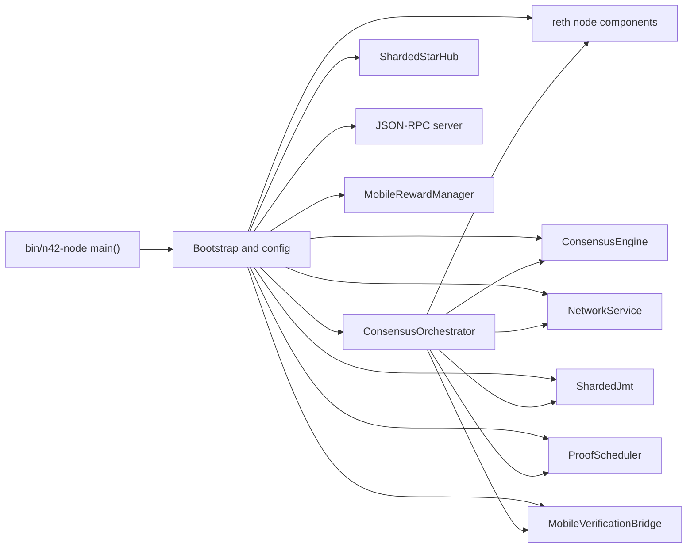
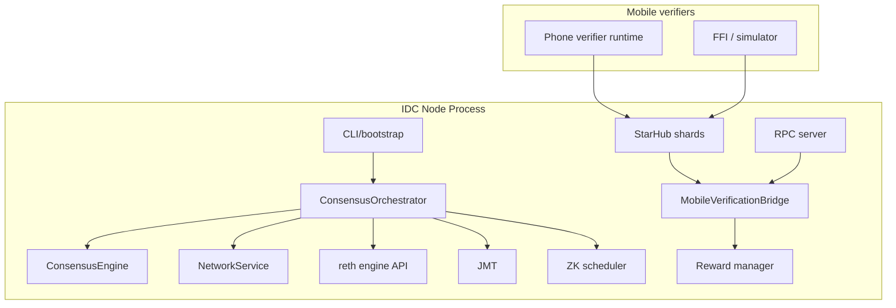

# System Architecture

## Executive summary

N42 is a high-performance blockchain node that combines:

- HotStuff-2 style BFT consensus
- reth-backed EVM execution
- a libp2p-based validator network
- a QUIC-based mobile verifier side channel
- JMT state commitment and proof serving
- optional asynchronous ZK proof generation

The system is intentionally split into an on-critical-path validator plane and an off-critical-path verification plane.

## Runtime composition

## Major planes

### 1. Consensus plane

Purpose:

- elect leader
- propose blocks
- collect votes and timeout certificates
- finalize commits

Primary code:

- [`crates/n42-consensus/src/`](/Users/jieliu/Documents/n42/n42-26/crates/n42-consensus/src)
- [`crates/n42-node/src/orchestrator/`](/Users/jieliu/Documents/n42/n42-26/crates/n42-node/src/orchestrator)

### 2. Execution plane

Purpose:

- build payloads through reth integration
- import committed blocks
- optionally generate execution witness and compact execution output
- derive state diffs for JMT and mobile verification

Primary code:

- [`crates/n42-execution/src/`](/Users/jieliu/Documents/n42/n42-26/crates/n42-execution/src)
- [`crates/n42-node/src/payload.rs`](/Users/jieliu/Documents/n42/n42-26/crates/n42-node/src/payload.rs)
- [`crates/n42-node/src/orchestrator/execution_bridge.rs`](/Users/jieliu/Documents/n42/n42-26/crates/n42-node/src/orchestrator/execution_bridge.rs)

### 3. P2P validator network plane

Purpose:

- consensus message dissemination
- block announcement and direct block delivery
- transaction forwarding to leader
- state sync and peer management

Primary code:

- [`crates/n42-network/src/service.rs`](/Users/jieliu/Documents/n42/n42-26/crates/n42-network/src/service.rs)
- [`crates/n42-network/src/transport.rs`](/Users/jieliu/Documents/n42/n42-26/crates/n42-network/src/transport.rs)

### 4. Mobile verification plane

Purpose:

- push verification packets to phones
- collect signed receipts
- aggregate attestation state
- feed reward accounting

Primary code:

- [`crates/n42-network/src/mobile/star_hub.rs`](/Users/jieliu/Documents/n42/n42-26/crates/n42-network/src/mobile/star_hub.rs)
- [`crates/n42-node/src/mobile_bridge.rs`](/Users/jieliu/Documents/n42/n42-26/crates/n42-node/src/mobile_bridge.rs)
- [`crates/n42-mobile/src/`](/Users/jieliu/Documents/n42/n42-26/crates/n42-mobile/src)

### 5. Proof and state proof plane

Purpose:

- maintain JMT root and proofs
- generate and store asynchronous ZK proofs
- expose proof queries via RPC

Primary code:

- [`crates/n42-jmt/src/`](/Users/jieliu/Documents/n42/n42-26/crates/n42-jmt/src)
- [`crates/n42-zkproof/src/`](/Users/jieliu/Documents/n42/n42-26/crates/n42-zkproof/src)

## Process-level architecture

## Critical-path versus non-critical-path work

### Critical path

- proposal creation
- proposal validation
- consensus vote and commit rounds
- block import/finalization

### Off critical path

- mobile packet dispatch
- mobile receipt aggregation
- mobile rewards
- JMT background updates
- ZK proof generation
- many observability and persistence tasks

This split matters operationally: a failure in mobile verification should not prevent consensus progress unless the implementation incorrectly couples the two.

## Shared state objects

### `SharedConsensusState`

Acts as the main cross-subsystem read/write bridge:

- latest committed QC
- attestation state
- authorized mobile verifiers
- equivocation log
- JMT root metadata
- ZK latest-proof metadata
- committed-block broadcast channel

### `AttestationStore`

Durable storage for:

- aggregated mobile attestations
- verifier registry bitfield mapping
- reward tracking continuity

### `ConsensusSnapshot`

Persistent recovery payload for:

- current view
- locked QC
- last committed QC
- consecutive timeout count
- staged epoch transition
- committed block count

## Architectural strengths

- clear separation between consensus engine and runtime orchestration
- strong modularization between validator network and mobile network
- room for scaling through background tasks, channel splits, and direct paths
- test harnesses exist at both crate and end-to-end levels

## Architectural friction points

- multiple optional subsystems are wired through one bootstrap path, making startup dense
- some state is shared by side effects across async tasks, which increases coupling risk
- security-sensitive mobile authorization spans `star_hub`, `mobile_bridge`, `consensus_state`, and `rpc`
- release readiness depends heavily on cross-module invariants rather than a single enforcement layer
