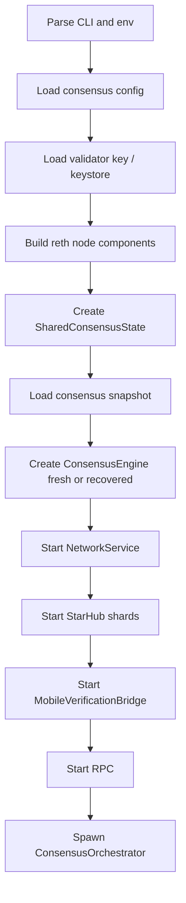
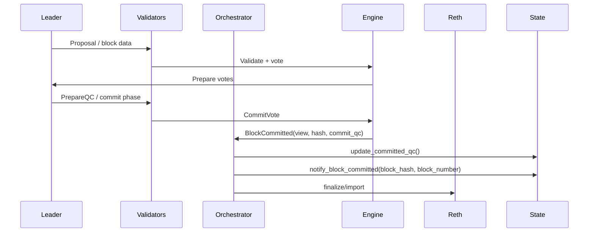
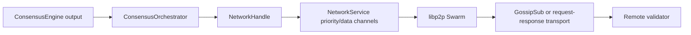
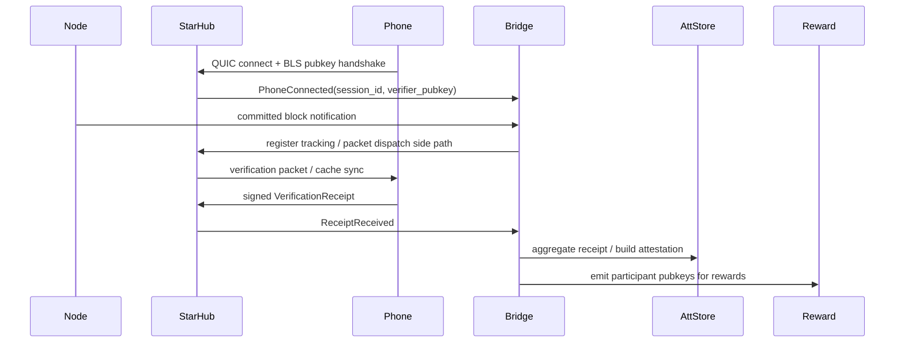
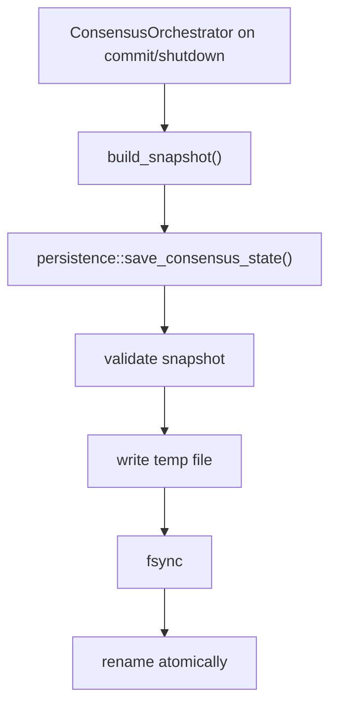
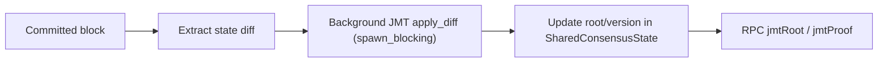
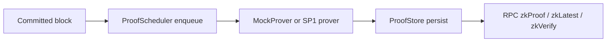
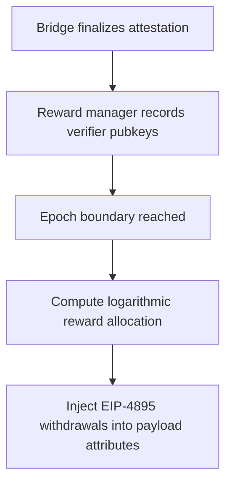
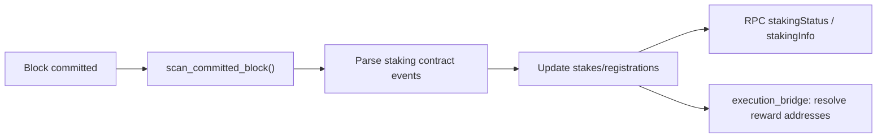
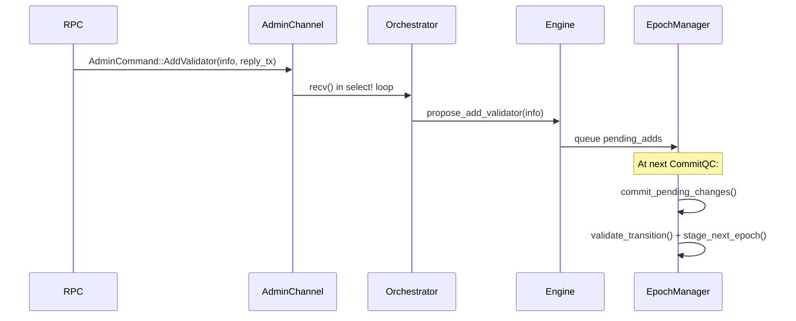

# Core Flows

## 1. Node startup and recovery

### Notes

- Snapshot load is an optimization and recovery enhancement, not the only boot path.
- If snapshot loading fails, current behavior is to log and start fresh.
- Mobile bridge is attached during bootstrap and subscribes to committed-block notifications.

## 2. Consensus commit path

### State transitions

- `ConsensusEngine` emits `EngineOutput`
- `ConsensusOrchestrator` owns runtime side effects
- `SharedConsensusState` is updated on commit
- observers such as RPC and mobile bridge consume committed-block notifications

## 3. Validator network message path

### Transport split

- consensus messages are routed via a high-priority channel
- block data and sync are also treated as priority traffic
- transaction gossip can be disabled in favor of direct leader forwarding

## 4. Mobile verification path

### Security invariants

- handshake pubkey must match receipt pubkey
- verifier authorization is runtime session state
- receipts must belong to tracked blocks
- reward emission should happen only after finalized aggregate attestation

## 5. Snapshot persistence path

### Recovery rules

- invalid snapshots must not be injected into `with_recovered_state`
- parse/validation failure should be visible in logs
- startup may choose to degrade to fresh-start behavior depending on product policy

## 6. JMT update path

> **⚠️ 未接入生产**：以下流程的代码全部存在（`consensus_loop.rs:366-408`、`rpc.rs:556-625`），但 `ShardedJmt` 从未在 `main.rs` 中构造。orchestrator 和 RPC 的 `jmt` 字段始终为 `None`，所有 JMT 相关代码路径都是死代码。

JMT 在 `bin/n42-node/src/main.rs:702`（RPC）和 `:1231`（orchestrator）通过 `with_jmt()` 注入。`apply_diff` 在 `consensus_loop.rs` 的 `handle_block_committed()` 末段 `spawn_blocking` 异步执行（详见 `devlog-52-jmt-full-integration.md`），不在共识关键路径上；每 100 块自动 `prune(200)` 回收旧版本。State root 时间通过 `n42_state_root_apply_diff_ms` histogram 暴露。

## 7. ZK sidecar path

## 8. Reward settlement path

## 9. Staking scan path

Staking state is persisted to `staking_state.json` and loaded on startup.

## 10. Validator reconfig path

> **⚠️ 无鉴权**：`proposeAddValidator`/`proposeRemoveValidator` 端点无权限控制。生产部署前需添加签名验证或 admin token。

## Where to debug each flow

| Flow | Primary files |
|---|---|
| Startup | `bin/n42-node/src/main.rs` |
| Consensus runtime | `crates/n42-node/src/orchestrator/mod.rs`, `consensus_loop.rs` |
| P2P network | `crates/n42-network/src/service.rs`, `transport.rs` |
| Mobile QUIC ingress | `crates/n42-network/src/mobile/star_hub.rs` |
| Mobile aggregation | `crates/n42-node/src/mobile_bridge.rs` |
| Reward settlement | `crates/n42-node/src/mobile_reward.rs`, `execution_bridge.rs:232-274` |
| Staking | `crates/n42-node/src/staking.rs`, `consensus_loop.rs:440-447` |
| Snapshot persistence | `crates/n42-node/src/persistence.rs` |
| RPC surface | `crates/n42-node/src/rpc.rs` |
| Validator reconfig | `consensus_state.rs` (AdminCommand), `orchestrator/mod.rs:1014` (handler) |
| JMT (stub) | `orchestrator/consensus_loop.rs:366-408` (dead code) |
| ZK proof | `n42-zkproof/src/scheduler.rs`, `consensus_loop.rs:410-437` |
