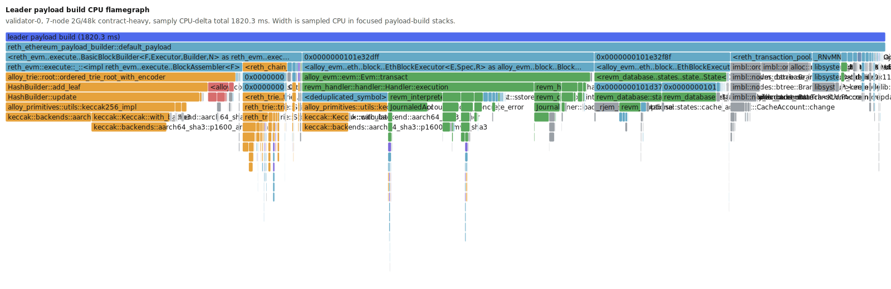

# Devlog 75: Leader payload EVM flamegraph

Date: 2026-06-16
Base: `main` at `f988fe8` (`Merge pull request #6 from n42blockchain/perf/evm-state-access-profile-7node`)
Branch: `perf/leader-evm-flamegraph-profile`
Reth baseline: unchanged, `chore/merge-upstream-fc2cc1e` at `449ecfdce`

## Scope

Devlog 74 established that the remaining 7-validator throughput limit is on the
execution side, especially leader payload build (`N42_PAYLOAD_PACK evm_exec_ms`) and the
large-block import/commit tail. This pass symbolicates the leader process and splits the
payload-build CPU path before wiring parallel EVM into the packer.

## Build and profiling hook

The profiling binary keeps release optimizations but retains debug info:

```bash
cargo build --profile profiling --bin n42-node --bin n42-stress --bin n42-mobile-sim
```

Result: passed, with only existing dependency warnings.

`scripts/testnet.sh` now supports a no-op-by-default profiling wrapper:

```bash
N42_PROFILE_VALIDATOR_INDEX=0 \
N42_PROFILE_OUTPUT=/tmp/n42-leader-evm-flamegraph-rerun/samply-v0.json \
./scripts/testnet.sh ...
```

When the index matches a validator, the script launches that node as:

```bash
samply record --save-only -o "$N42_PROFILE_OUTPUT" -- target/profiling/n42-node node ...
```

This avoids the macOS `task_for_pid` attach failure from devlog 71/74 because samply
launches the process directly. The raw `samply-v0.json` was 16 MB and is not committed.
The committed focused SVG is:



Note: samply wrote `symbolicated=false` in the profile metadata, but the profiling binary
contained usable DWARF. I resolved 23,247 sampled `n42-node` offsets offline with:

```bash
atos -arch arm64 -o target/profiling/n42-node -offset -f /tmp/n42-leader-evm-all-addrs.txt
```

The SVG uses those offline symbols and `threadCPUDelta` as the CPU-width source. Wall
sample weights were dominated by sleeping/waiting threads and are not useful for this
hot-path split.

## Run

The run used the same stable devlog-74 shape: 7 validators, `N42_TWIG=1`, 2 second slots,
2G gas limit, 48k tx cap, no explorer, external contract-heavy stress, and mobile-sim.

```bash
N42_BUILD_PROFILE=profiling \
N42_TWIG=1 \
N42_MAX_TXS_PER_BLOCK=48000 \
N42_GAS_LIMIT=2000000000 \
N42_PROFILE_VALIDATOR_INDEX=0 \
N42_PROFILE_OUTPUT=/tmp/n42-leader-evm-flamegraph-rerun/samply-v0.json \
N42_EXTRA_NODE_FLAGS="--engine.state-provider-metrics --engine.slow-block-threshold 0" \
./scripts/testnet.sh \
  --nodes 7 \
  --clean \
  --no-explorer \
  --no-tx-gen \
  --no-monitor \
  --block-interval 2000 \
  --data-dir /tmp/n42-leader-evm-flamegraph-rerun
```

Stress:

```bash
target/profiling/n42-stress \
  --rpc http://127.0.0.1:18000,http://127.0.0.1:18001,http://127.0.0.1:18002,http://127.0.0.1:18003,http://127.0.0.1:18004,http://127.0.0.1:18005,http://127.0.0.1:18006 \
  --erc20-ratio 100 \
  --target-tps 8000 \
  --duration 240 \
  --accounts 5000 \
  --batch-size 1000 \
  --accounts-per-batch 200 \
  --concurrency 2048 \
  --max-pool 250000 \
  --resume-pool 125000
```

Final stress result: 3,380,000 submitted in 243s, effective submission 13,892.9 TPS,
last-50 overall 12,228.6 TPS, max block 47,872 tx, avg gas 1.25G of 2G.

## Log calibration

Validator 0 produced 11 tx-bearing leader payloads during the sampled run.

| Metric | Min | p50 | p95 | Max | Avg |
| --- | ---: | ---: | ---: | ---: | ---: |
| `tx_count` | 16,000 | 47,872 | 48,000 | 48,000 | 40,495 |
| `packing_ms` | 52 | 382 | 1,013 | 1,013 | 441.9 |
| `evm_exec_ms` | 43 | 245 | 809 | 809 | 324.7 |
| `pool_overhead_ms` | 9 | 60 | 347 | 347 | 116.9 |
| `iter_ms` | 6 | 35 | 280 | 280 | 79.5 |

For near-full blocks (`tx_count >= 47000`, 7 rows), `evm_exec_ms` was p50/p95
401/809ms and `packing_ms` was p50/p95 444/1,013ms. This matches the devlog-74 stable
2G/48k range.

`N42_FINISH_BREAKDOWN` for the same 11 tx-bearing builder finishes:

| Metric | Min | p50 | p95 | Max | Avg |
| --- | ---: | ---: | ---: | ---: | ---: |
| `state_root_ms` | 7 | 11 | 188 | 188 | 32.2 |
| `assemble_block_ms` | 16 | 148 | 422 | 422 | 176.7 |
| `total_finish_ms` | 28 | 164 | 563 | 563 | 223.3 |

The new-payload/import side still shows the larger tail when cache misses force full
execution: 19 `is_cache_hit=false` rows had `evm_ms` p50/p95 1,472/2,212ms. Cache hits
were p95 3ms.

## Whole-process profile

The whole validator process is not a good proxy for `evm_exec_ms`: over the full stress
window, CPU delta was dominated by txpool/RPC admission and signature recovery.

| Primary path | CPU delta | Share |
| --- | ---: | ---: |
| txpool/RPC admission | 121.7s | 47.5% |
| kernel/wait/syscall | 77.5s | 30.3% |
| network/consensus | 28.1s | 11.0% |
| newPayload import/validate | 2.9s | 1.1% |
| leader payload build | 1.8s | 0.7% |
| payload resolve/serialize | 1.8s | 0.7% |

The self-time leaf table confirms that the process-wide top functions are mostly outside
leader EVM execution: `rustsecp256k1_*`, transaction RLP/recovery, kernel waits, RocksDB
background, keccak, and ZSTD. The focused flamegraph therefore starts at
`N42InnerPayloadBuilder::try_build/default_ethereum_payload`.

## Focused leader payload split

Focused payload-build CPU delta in the sampled validator-0 leader path was 1.820s.

| Subpath | CPU delta | Share of focused payload build | Parallel-EVM relevance |
| --- | ---: | ---: | --- |
| per-tx EVM execution | 604.7ms | 33.2% | parallelizable if conflicts permit |
| block finish / roots | 613.4ms | 33.7% | mostly serial after tx execution |
| payload other | 423.1ms | 23.2% | mixed allocator/collections/tracing/unresolved |
| txpool selection | 179.1ms | 9.8% | mostly serial selection/iteration |

Important detail: `N42_PAYLOAD_PACK evm_exec_ms` is accumulated around each
`execute_transaction` call. The block finish/root path is separately visible through
`N42_FINISH_BREAKDOWN`; it should not be counted as per-tx EVM even though it is inside
`default_ethereum_payload`.

### Per-tx EVM execution

| Bucket | CPU delta | Share of per-tx EVM |
| --- | ---: | ---: |
| hash/trie inside tx execution | 179.8ms | 29.7% |
| state journal/cache/bundle | 150.3ms | 24.9% |
| other/unresolved revm frames | 167.0ms | 27.6% |
| revm opcode/host instruction leafs | 39.3ms | 6.5% |
| host/provider/db | 33.9ms | 5.6% |
| alloc/collections/mem | 29.2ms | 4.8% |

Top per-tx EVM self-time leafs:

| Leaf | CPU delta | Share |
| --- | ---: | ---: |
| `keccak::backends::aarch64_sha3::p1600_armv8_sha3` | 102.0ms | 16.9% |
| `JournaledAccount::sload_concrete_error` | 76.5ms | 12.7% |
| `alloy_primitives::utils::keccak256_impl` | 75.5ms | 12.5% |
| `revm_handler::handler::Handler::execution` | 58.0ms | 9.6% |
| `revm_database_interface::Database::basic` | 31.2ms | 5.2% |
| `revm_interpreter::instructions::host::sstore` | 30.7ms | 5.1% |
| `JournalInner::load_account_mut_optional` | 24.6ms | 4.1% |

This is not mainly interpreter dispatch. The visible per-tx cost is state-heavy:
SLOAD/SSTORE journal/cache work plus keccak/hash work around storage/account access.
Host/provider DB leafs are modest, which matches devlog-74's 98-100% cache hit rates.

### Block finish / roots

| Bucket | CPU delta | Share of finish/root |
| --- | ---: | ---: |
| hash/trie | 458.7ms | 74.8% |
| other | 85.4ms | 13.9% |
| tx RLP/recover/hash | 35.7ms | 5.8% |
| alloc/collections/mem | 20.7ms | 3.4% |

Top finish/root self-time leafs:

| Leaf | CPU delta | Share |
| --- | ---: | ---: |
| `keccak::backends::aarch64_sha3::p1600_armv8_sha3` | 354.3ms | 57.8% |
| `TxEip1559::rlp_encoded_fields_length` | 18.6ms | 3.0% |
| `BranchNodeRef::encode` | 18.0ms | 2.9% |
| `HashBuilder::update` | 16.5ms | 2.7% |
| `reth_trie::trie::StateRoot::calculate` | 9.7ms | 1.6% |

This maps to `BlockBuilder::finish -> assemble_block/root` rather than the per-tx
execution loop. Parallel EVM will not remove this serial root/assembly cost.

## Parallelization read

For leader payload build, the strict per-tx EVM bucket is about one third of sampled CPU.
If a Block-STM path perfectly removed only that bucket, the payload-build CPU upper bound
is roughly:

```text
1 / (1 - 0.332) = 1.50x
```

That is worth pursuing, but it is not a 3-5x lever by itself. The current hotspot says the
parallel path must include state journal/cache/SLOAD/SSTORE work, not just interpreter
dispatch. It also says we need a second line of work for serial block finish/root
hashing/assembly and for the import/commit tail; otherwise parallel EVM can improve the
tx loop while the slot remains capped by finish/import.

Recommended next step:

1. Integrate parallel EVM behind a flag into the payload builder and measure only the
   strict `evm_exec_ms` delta first.
2. Keep `N42_FINISH_BREAKDOWN` in the same run; a faster tx loop will make finish/root
   share larger.
3. Add a root/assembly optimization track if `assemble_block_ms` and keccak-heavy trie
   finish become the new p95 limiter.
4. Keep the import/cache-miss path visible, because `new_payload` p95 was still 2.2s on
   cache misses in this run.
