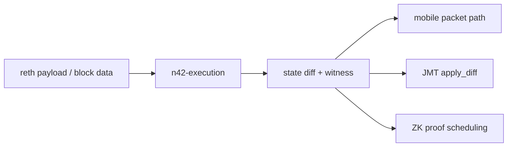
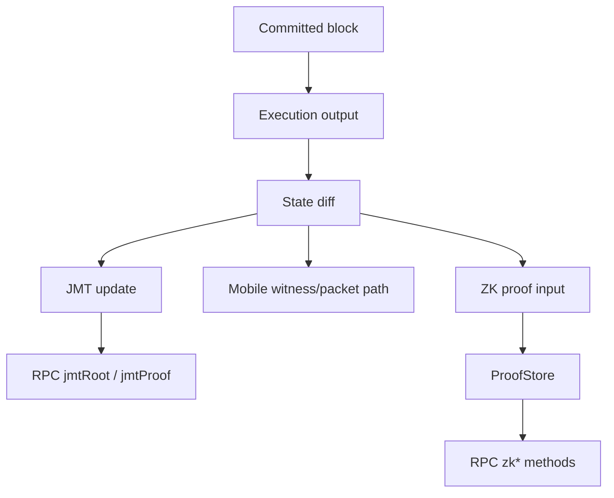

# Module Deep Dive: Execution, JMT, Parallel EVM, and ZK

## Scope

This document groups the data-plane libraries:

- `n42-execution`
- `n42-parallel-evm`
- `n42-jmt`
- `n42-zkproof`

These modules are tightly related even though they are in separate crates.

## Execution stack

## `n42-execution`

Main responsibilities:

- EVM config adaptation
- full block execution helpers
- execution witness extraction
- state diff derivation
- read-log support

Key files:

- [`crates/n42-execution/src/executor.rs`](/Users/jieliu/Documents/n42/n42-26/crates/n42-execution/src/executor.rs)
- [`crates/n42-execution/src/witness.rs`](/Users/jieliu/Documents/n42/n42-26/crates/n42-execution/src/witness.rs)
- [`crates/n42-execution/src/state_diff.rs`](/Users/jieliu/Documents/n42/n42-26/crates/n42-execution/src/state_diff.rs)

## `n42-parallel-evm`

Purpose:

- optimistic parallel execution of transaction batches
- conflict detection and re-execution
- sequential fallback on non-convergence or small batches

Core pieces:

- `MvMemory`
- `ParallelDb`
- `Scheduler`
- worker loop

This crate is performance-sensitive rather than consensus-safety-critical, but bad bugs here can create execution divergence.

## `n42-jmt`

Purpose:

- maintain a Jellyfish Merkle Tree over state
- support proof generation
- support sharded updates for throughput

Key modules:

- `tree.rs`
- `proof.rs`
- `sharded.rs`
- `snapshot.rs`

Primary runtime relationship:

- orchestrator extracts state diffs from committed blocks
- background task applies diffs to `ShardedJmt`
- latest root/version is exposed through RPC

## `n42-zkproof`

Purpose:

- abstract proof generation backend
- schedule proofs asynchronously
- store proof artifacts and metadata
- expose verification information through RPC

Key modules:

- `scheduler.rs`
- `prover.rs`
- `sp1_prover.rs`
- `store.rs`

## Cross-subsystem data flow

## Risks to track

- divergence between execution result and witness generation
- background JMT lag versus latest committed head
- proof scheduler backlog or store corruption
- parallel EVM fallback behavior hiding determinism bugs
