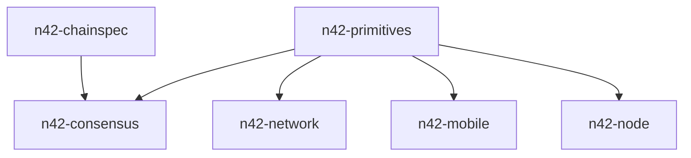

# Module Deep Dive: Foundations (`n42-primitives` and `n42-chainspec`)

## Why these crates matter

These two crates define the language spoken by the rest of the workspace.
They are comparatively small, but they influence nearly every other crate.

## `n42-primitives`

### Role

- BLS keys and signature helpers
- aggregate signature utilities
- consensus message and QC structures
- shared serialization-safe domain types

### Module map

```text
n42-primitives
├── bls/
│   ├── aggregate.rs
│   ├── keys.rs
│   ├── mod.rs
│   └── verify.rs
└── consensus/
    ├── messages.rs
    └── mod.rs
```

### Main consumers

- `n42-consensus`
- `n42-node`
- `n42-mobile`
- `n42-network`

### Audit relevance

- message signing domains
- QC encoding/verification
- BLS key parsing and validation

## `n42-chainspec`

### Role

- consensus config definition
- validator identity list
- dev/test helper configuration
- N42-specific chain ID and default specs

### Key exported concepts

- `ConsensusConfig`
- `ValidatorInfo`
- helper constructors such as dev/dev-multi configurations

### Why it matters operationally

- a bad chainspec or consensus config can invalidate runtime assumptions before the node even starts
- validator identity mismatches here ripple into networking, consensus, and reward logic

## Foundational dependency graph



## Review focus

When doing correctness or security review, check these crates first if the issue involves:

- signature format
- validator identity
- quorum certificate structure
- config validation
- deterministic dev/test validator derivation
