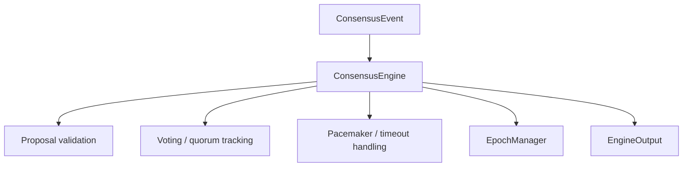

# Module Deep Dive: `n42-consensus`

## Purpose

`n42-consensus` provides the deterministic core of the N42 consensus protocol.
It is the protocol engine, not the process runtime.

## Export surface

Public exports include:

- `ConsensusEngine`
- `ConsensusEvent`
- `EngineOutput`
- `ViewTiming`
- `EpochManager`
- `LeaderSelector`
- `ValidatorSet`
- QC verification helpers

## Module map

```text
n42-consensus
├── adapter.rs
├── error.rs
├── extra_data.rs
├── protocol/
│   ├── decision.rs
│   ├── mod.rs
│   ├── pacemaker.rs
│   ├── proposal.rs
│   ├── quorum.rs
│   ├── round.rs
│   ├── state_machine.rs
│   ├── timeout.rs
│   └── voting.rs
└── validator/
    ├── epoch.rs
    ├── mod.rs
    ├── selection.rs
    └── set.rs
```

## Logical flow



## Protocol stages

### Proposal handling

- validate justify QC
- enforce lock rule
- decide whether to vote

### Voting

- round-1 vote collection
- quorum detection
- PrepareQC generation

### Decision / commit

- commit vote collection
- commit QC generation
- block commit emission

### Timeout recovery

- pacemaker timeout
- timeout message broadcast
- timeout certificate
- view change

## Why this crate matters

It is the single most safety-critical crate after primitives:

- if its state machine is wrong, safety fails
- if its output contracts are ambiguous, orchestrator regressions happen

## Boundary with `n42-node`

`n42-consensus` should not directly:

- talk to libp2p
- write files
- call reth
- know about mobile verifiers

Instead it emits `EngineOutput` and expects the outer runtime to realize side effects.

This boundary is one of the stronger architectural decisions in the workspace.
