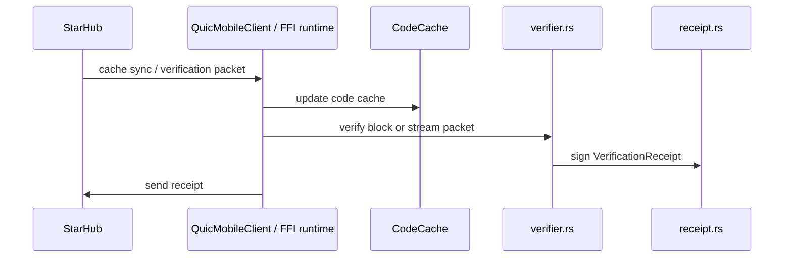

# Module Deep Dive: `n42-mobile` and `n42-mobile-ffi`

## Purpose

These crates define the phone-side verification plane:

- packet decoding
- local verification
- receipt signing
- code cache maintenance
- aggregate attestation helpers
- platform bindings for Android and iOS

## `n42-mobile` module map

```text
n42-mobile
├── attestation.rs
├── code_cache.rs
├── packet.rs
├── quic_client.rs
├── receipt.rs
├── serde_helpers.rs
├── verification.rs
├── verifier.rs
└── wire.rs
```

## `n42-mobile-ffi` module map

```text
n42-mobile-ffi
├── lib.rs
├── context.rs
├── transport.rs
├── android.rs
└── ios.rs
```

## Phone-side flow



## Security-sensitive surfaces

### `receipt.rs`

- receipt schema
- signature creation and verification

### `verification.rs`

- receipt aggregation helper types
- threshold bookkeeping
- duplicate verifier handling

### `attestation.rs`

- BLS aggregate attestation builder
- verifier registry / participant bitfield handling

### `quic_client.rs` and FFI transport

- client connectivity
- timeout semantics
- cache sync and packet receive loop

## Platform integration notes

`n42-mobile-ffi` is more than a thin ABI layer. It creates and owns:

- the verifier context
- BLS signing key
- tokio runtime
- QUIC connection state
- code cache
- statistics and last verification info

That means mobile-platform bugs can alter correctness, not just ergonomics.

## Operational value

- `bin/n42-mobile-sim` can exercise the protocol at scale
- FFI bindings make it feasible to reuse the same core logic on Android and iOS

## Primary audit concerns

- wire format stability
- receipt signature correctness
- code cache invalidation correctness
- packet-to-receipt identity binding
- mobile-side panic or timeout behavior
