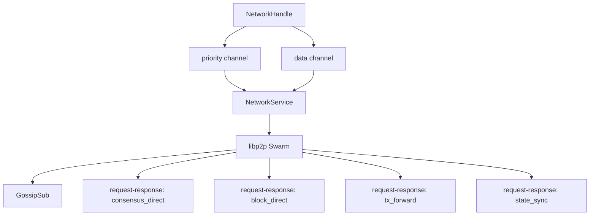
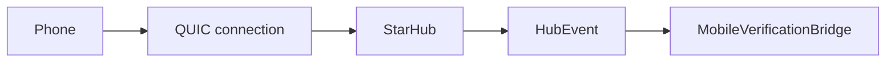

# Module Deep Dive: `n42-network`

## Purpose

`n42-network` contains two distinct networking planes:

- validator-to-validator libp2p networking
- node-to-phone QUIC mobile networking

Those planes are intentionally separate because they have different trust, load, and protocol requirements.

## Module map

```text
n42-network
├── service.rs
├── transport.rs
├── dissemination.rs
├── reconnection.rs
├── codec.rs
├── error.rs
├── state_sync.rs
├── consensus_direct.rs
├── block_direct.rs
├── tx_forward.rs
├── gossipsub/
│   ├── mod.rs
│   ├── topics.rs
│   └── handlers.rs
└── mobile/
    ├── mod.rs
    ├── star_hub.rs
    ├── sharded_hub.rs
    └── session.rs
```

## Validator network architecture



## Mobile network architecture



## Key files

### `service.rs`

Runtime bridge between libp2p swarm and node layer:

- owns command channels
- emits typed `NetworkEvent`
- prioritizes consensus and block traffic
- manages peer maps and reconnect behavior

### `transport.rs`

Constructs the composite `N42Behaviour`:

- GossipSub
- Identify
- state sync request-response
- direct consensus messages
- direct block transfer
- tx forwarding
- optional mDNS and Kademlia

### `mobile/star_hub.rs`

High-concurrency QUIC ingress for phone verifiers:

- receives handshake pubkey
- tracks per-session state
- accepts receipt streams
- forwards events to node layer
- pushes packet/cache messages to phones

### `mobile/sharded_hub.rs`

Scales StarHub horizontally by sharding connections across multiple hubs.

## Traffic classes

| Traffic | Path | Reliability priority |
|---|---|---|
| consensus vote/proposal | priority channel + gossipsub/direct | highest |
| block data | priority channel + gossipsub/direct | highest |
| tx forwarding | data path/direct leader | medium |
| sync responses | request-response | high |
| mobile packets | QUIC StarHub uni-streams | separate plane |
| mobile receipts | QUIC ingress to hub events | separate plane |

## Important invariants

- validator peer mapping must stay correct for direct messaging
- high-volume tx traffic must not starve consensus traffic
- StarHub handshake identity and receipt identity must match
- disconnect events must reach the bridge reliably enough to prevent stale authorization state

## Audit hotspots

- backpressure handling in `service.rs`
- peer identity assumptions in `transport.rs`
- receipt acceptance and session lifecycle in `mobile/star_hub.rs`
