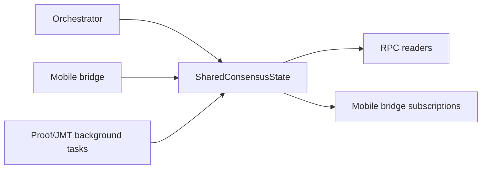
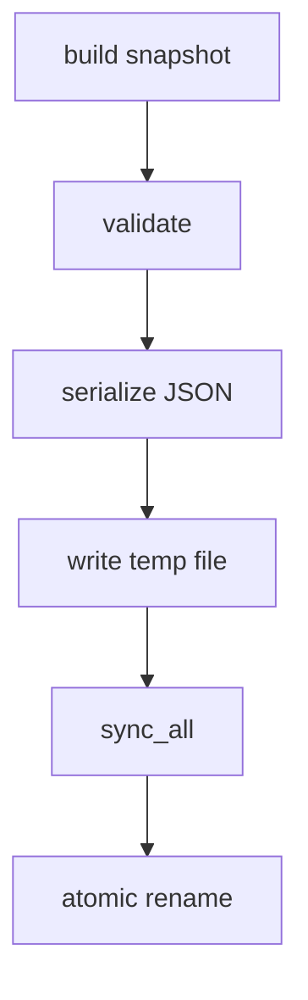

# `n42-node` Subsystem: Control Plane

## Scope

This document covers:

- `consensus_state.rs`
- `rpc.rs`
- `persistence.rs`

## Responsibility summary

This subsystem provides the shared coordination state and public control surface around the node.

## `consensus_state.rs`

### Core structures

| Type | Role |
|---|---|
| `VerificationTask` | committed-block notification sent to mobile consumers and RPC subscriptions |
| `AttestationState` | rolling per-block attestation dedup and threshold tracking |
| `AttestationRecord` | historical record of threshold-reaching events |
| `EquivocationEvidence` | operator-visible evidence of double-voting |
| `SharedConsensusState` | central shared runtime state object |

### Key state domains

- latest committed QC
- validator set reference
- attestation tracking
- committed-block broadcast channel
- equivocation log
- authorized verifier set
- JMT root metadata
- ZK latest proof metadata

### Flow

## `rpc.rs`

### Exposed groups

- health / consensus status
- validator set
- mobile attestation submission
- attestation stats/history
- equivocation evidence
- staking status/info
- JMT root/proof/version
- ZK proof lookup and verification

### Security-sensitive method

`submitAttestation` is the highest-risk method in this file because it crosses from external caller input into attestation state mutation.

Current expected checks:

- parse and length-check pubkey/signature
- verify BLS signature over `block_hash`
- require verifier authorization
- require tracked block hash in attestation state

### Operator risk

This RPC surface is broad. Release review should explicitly validate:

- exposure defaults
- CORS policy
- authorization semantics
- high-volume method abuse resistance

## `persistence.rs`

### `ConsensusSnapshot`

Tracks:

- snapshot version
- current view
- locked QC
- last committed QC
- consecutive timeouts
- staged epoch transition
- committed block count
- compatibility-only legacy verifier field

### Save path

### Load path

- `Ok(None)` when file does not exist
- `Err` when file exists but parse/validation fails
- caller decides whether to fail startup or continue fresh

## Audit questions

- Is the verifier authorization set strictly runtime-only?
- Can any RPC path mutate attestation state without prior block tracking?
- Can invalid snapshot state re-enter consensus recovery?
- Are operator-facing errors explicit enough for recovery decisions?
