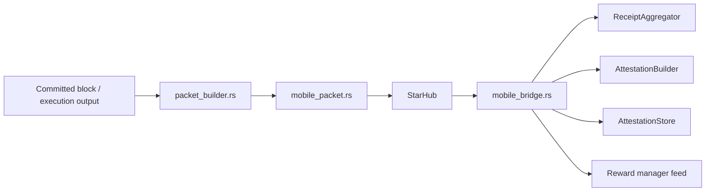
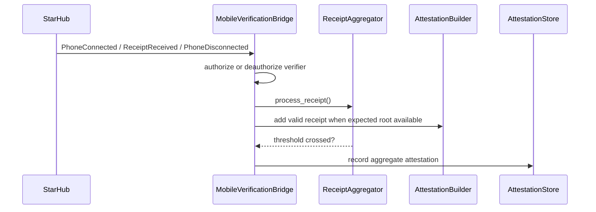

# `n42-node` Subsystem: Mobile Verification

## Scope

This document covers:

- `mobile_bridge.rs`
- `mobile_packet.rs`
- `packet_builder.rs`
- `attestation_store.rs`

## Runtime goal

The mobile subsystem turns committed blocks into a secondary verification stream performed by phone verifiers.

It has four stages:

1. packet generation
2. packet delivery
3. receipt aggregation
4. durable attestation and reward emission

## Structural view

## File-by-file responsibilities

### `packet_builder.rs`

Builds a `VerificationPacket` from block execution context.

Primary concern:

- whether packet contents fully and deterministically represent the state phones need to verify

### `mobile_packet.rs`

Coordinates packet generation and broadcast behavior.

Responsibilities include:

- retry policy
- cache-aware packet generation
- message size and failure handling

### `mobile_bridge.rs`

This is the policy core of the mobile verification plane.

Key duties:

- maintain connected verifier sessions
- authorize/deauthorize runtime verifier identities
- subscribe to committed-block notifications
- register tracked blocks
- verify receipt signatures
- aggregate valid receipts and detect invalid receipt divergence
- finalize aggregate attestation
- emit reward credits

### `attestation_store.rs`

Durable record of:

- verifier registry
- aggregate attestations
- reward points/statistics

## Receipt processing flow

## High-value invariants

- handshake identity and receipt identity are the same verifier
- only tracked blocks count toward threshold
- duplicate verifier receipts do not increase count
- invalid receipt roots do not create rewards
- reward emission occurs only after aggregate finalization
- disconnect removes runtime authorization

## Audit focus

- session lifecycle reliability
- stale authorization state
- untracked-block receipt handling
- reward double-count risk
- aggregate bitfield correctness
