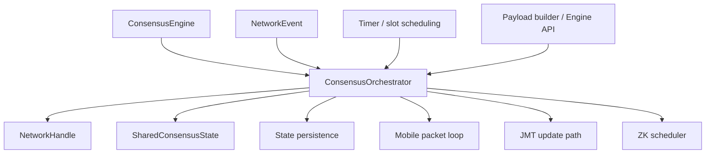
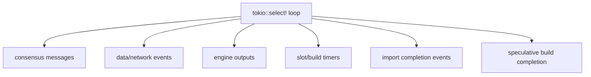

# `n42-node` Subsystem: Orchestrator

## Scope

This document covers:

- `orchestrator/mod.rs`
- `orchestrator/consensus_loop.rs`
- `orchestrator/execution_bridge.rs`
- `orchestrator/state_mgmt.rs`
- `orchestrator/observer.rs`

## Why this subsystem matters

The orchestrator is the runtime realization of consensus.
`n42-consensus` decides what should happen; the orchestrator makes it happen against:

- libp2p
- reth engine API
- persistence
- mobile side paths
- sync and observability

## Structural view

## File-by-file responsibilities

### `orchestrator/mod.rs`

Holds the main orchestrator state object.

Key responsibilities:

- owns all runtime channels
- tracks pending block data and import queues
- coordinates sync state
- tracks speculative builds and pipeline timing
- stores committed ring buffer

Important fields to understand:

- `consensus_event_rx`
- `net_event_rx`
- `output_rx`
- `pending_block_data`
- `syncing_blocks`
- `bg_import_queue`
- `pipeline_timings`
- `committed_block_count`

### `orchestrator/consensus_loop.rs`

Handles `EngineOutput`:

- `BroadcastMessage`
- `SendToValidator`
- `ExecuteBlock`
- `BlockCommitted`
- `ViewChanged`
- `SyncRequired`
- `EquivocationDetected`
- `EpochTransition`

This file is where the abstract state machine is bound to real side effects.

### `orchestrator/execution_bridge.rs`

Bridges block execution artifacts into dissemination and import logic.

Notable concerns:

- execution output serialization
- block data broadcast and direct push
- eager import behavior
- blob sidecar broadcast
- payload warmup and speculative build timing

### `orchestrator/state_mgmt.rs`

Owns durable state snapshots and sync-serving support.

Key duties:

- build snapshot
- save on commit/shutdown
- maintain committed block ring buffer
- answer sync requests from peers

### `orchestrator/observer.rs`

Observer mode variant of orchestrator for nodes that ingest and follow without producing.

## Main event loop model

## Critical runtime sequences

### Commit handling

1. increment committed block count
2. update committed QC
3. publish `VerificationTask`
4. persist snapshot
5. trigger JMT/ZK side effects
6. update ring buffer and metrics

### Payload scheduling

1. check empty-block policy
2. align to slot boundary or fast-propose delay
3. avoid duplicate builds on same parent
4. notify build completion to clear guards

### Sync handling

1. detect lag or `SyncRequired`
2. request block sync
3. import received blocks
4. clear in-flight tracking

## Audit focus

- select-loop starvation or biased scheduling issues
- duplicate build / duplicate import races
- stale queued block data
- mismatch between committed block count and view
- persistence timing relative to commit confirmation
