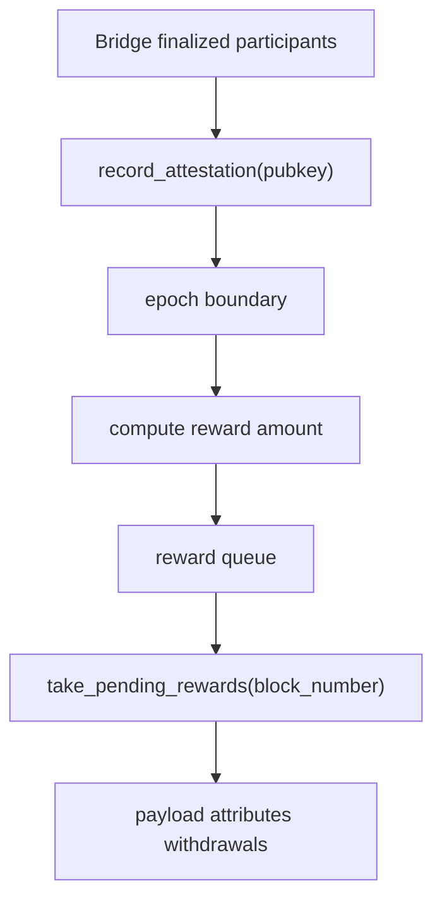

# `n42-node` Subsystem: Payload, Reward, and Staking

## Scope

This document covers:

- `payload.rs`
- `mobile_reward.rs`
- `staking.rs`

## Why these files belong together

They all influence economic output:

- payload building determines what enters a block
- reward logic decides which withdrawals are injected
- staking decides which verifier identities are economically recognized

## `payload.rs`

### Role

Wraps reth payload building for N42-specific integration.

### Main structures

- `N42PayloadBuilder`
- `N42InnerPayloadBuilder`

### Operational role

- log pool depth at build time
- build normal or empty payloads
- reuse Ethereum payload logic while keeping N42 consensus metadata external

### Important note

QC data is intentionally not packed into block `extra_data` because the Engine API limit would be exceeded.

## `mobile_reward.rs`

### Role

Transforms successful mobile attestation participation into queued EIP-4895 withdrawals.

### Main responsibilities

- track per-epoch attestation counts
- apply logarithmic reward curve
- apply staked versus unstaked multiplier
- queue capped withdrawal outputs
- dispense rewards into blocks with deterministic indices

### Economic flow

## `staking.rs`

### Role

Maintains staking and registration state for mobile verifiers.

### Data concepts

| Concept | Meaning |
|---|---|
| `StakeEntry` | stake amount and lifecycle status |
| `RegistrationEntry` | verifier registration metadata |
| `StakeStatus` | active / cooling down / unstaked style state |
| `StakingManager` | runtime + persisted staking registry |

### Why it matters to mobile security

The mobile bridge can optionally require verifiers to be registered or staked before they are authorized.

That means staking is not only an economics module; it is also part of the verifier admission policy.

## Audit focus

- reward queue overflow/drop behavior
- deterministic reward ordering
- staking persistence correctness
- verifier registration checks in bridge path
