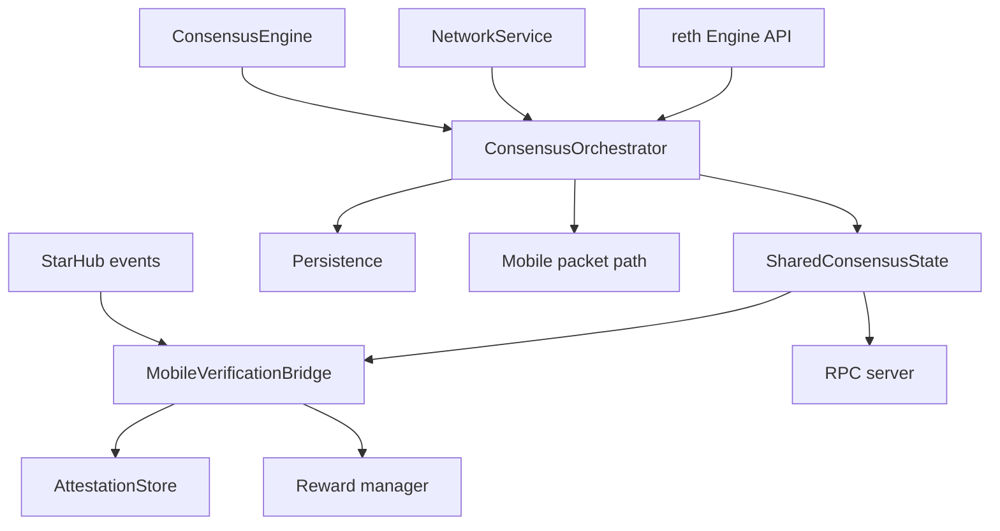
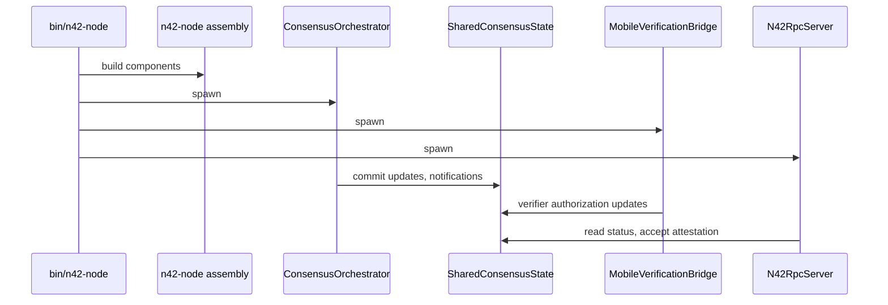

# Module Deep Dive: `n42-node`

## Purpose

`n42-node` is the product assembly crate. It does not implement the consensus protocol itself, but it is where most runtime behavior becomes real:

- orchestration
- persistence
- RPC exposure
- mobile receipt aggregation
- reward accounting
- reth integration glue

## Public module map

```text
n42-node
├── attestation_store.rs
├── consensus_state.rs
├── epoch_schedule.rs
├── mobile_bridge.rs
├── mobile_packet.rs
├── mobile_reward.rs
├── orchestrator/
│   ├── mod.rs
│   ├── consensus_loop.rs
│   ├── execution_bridge.rs
│   ├── observer.rs
│   └── state_mgmt.rs
├── packet_builder.rs
├── payload.rs
├── persistence.rs
├── pool.rs
├── rpc.rs
├── staking.rs
├── inject.rs
└── tx_bridge.rs
```

## Runtime role



## Key modules

### `orchestrator/mod.rs`

Owns the central event loop state:

- network receivers
- consensus engine output receiver
- block ready signals
- payload build bookkeeping
- import queues
- sync coordination
- pipeline timing

This is the highest-value file for understanding runtime behavior.

### `orchestrator/consensus_loop.rs`

Handles runtime side effects from consensus engine outputs:

- broadcast consensus messages
- execute/import blocks
- commit handling
- epoch transitions
- speculative build scheduling

### `orchestrator/state_mgmt.rs`

Persists and restores durable runtime state:

- consensus snapshot
- committed block ring buffer
- sync-serving surfaces

### `consensus_state.rs`

Shared mutable runtime state visible to non-consensus subsystems:

- committed QC
- attestation history/state
- equivocation evidence
- verifier authorization set
- JMT metadata
- ZK metadata
- committed-block pub-sub

### `mobile_bridge.rs`

Bridges the mobile network side channel to the node:

- authorizes/deauthorizes verifier pubkeys on connect/disconnect
- tracks eligible blocks
- validates and aggregates receipts
- persists aggregate attestations
- emits reward credits

### `rpc.rs`

Defines the `n42_*` JSON-RPC namespace:

- health and consensus status
- attestation submission and querying
- staking surfaces
- JMT proof surfaces
- ZK proof surfaces

### `persistence.rs`

Defines `ConsensusSnapshot` and atomic save/load semantics.

## Operational flow inside `n42-node`



## Notable design strengths

- most external side effects are centralized in one crate
- `SharedConsensusState` reduces ad hoc direct coupling across many async tasks
- mobile, persistence, RPC, and proof systems can evolve mostly independently

## Notable design risks

- this crate is broad and has a high change surface
- security boundaries are spread across several files
- orchestrator state machine is powerful but dense; regression risk is non-trivial

## Files to review first during audits

- [`crates/n42-node/src/orchestrator/mod.rs`](/Users/jieliu/Documents/n42/n42-26/crates/n42-node/src/orchestrator/mod.rs)
- [`crates/n42-node/src/orchestrator/consensus_loop.rs`](/Users/jieliu/Documents/n42/n42-26/crates/n42-node/src/orchestrator/consensus_loop.rs)
- [`crates/n42-node/src/mobile_bridge.rs`](/Users/jieliu/Documents/n42/n42-26/crates/n42-node/src/mobile_bridge.rs)
- [`crates/n42-node/src/rpc.rs`](/Users/jieliu/Documents/n42/n42-26/crates/n42-node/src/rpc.rs)
- [`crates/n42-node/src/persistence.rs`](/Users/jieliu/Documents/n42/n42-26/crates/n42-node/src/persistence.rs)

## Subsystem drill-downs

- [`Docs/modules/n42-node-orchestrator.md`](/Users/jieliu/Documents/n42/n42-26/Docs/modules/n42-node-orchestrator.md)
- [`Docs/modules/n42-node-control-plane.md`](/Users/jieliu/Documents/n42/n42-26/Docs/modules/n42-node-control-plane.md)
- [`Docs/modules/n42-node-mobile-subsystem.md`](/Users/jieliu/Documents/n42/n42-26/Docs/modules/n42-node-mobile-subsystem.md)
- [`Docs/modules/n42-node-payload-reward-staking.md`](/Users/jieliu/Documents/n42/n42-26/Docs/modules/n42-node-payload-reward-staking.md)
