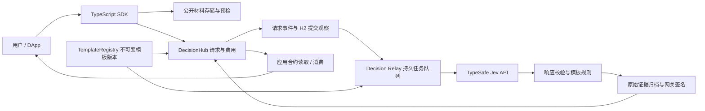

# N42 × TypeSafe Jev：链上 AI 决策服务设计

日期：2026-09-24。状态：架构评审草案，尚未实现、部署或调用付费 API。

## 1. 目标与产品形态

用户已确认目标为“面向用户的链上 AI 决策能力”。本方案将 Jev 接入 N42 的应用层，提供
可付费请求、可追踪来源、可由合约消费的结构化 AI 判断，暂称 **N42 Decision**。

开发者定义问题模板，用户提交材料并支付请求费用，Jev 判断后返回选项、评分或概率。
N42 保存请求和结果承诺，验证提交者身份，执行应用预先定义的规则。首期用公开社区提案的
分类与审核分流演示完整体验；这是方案选择，用户尚未指定具体首发应用。

成功标准：用户能在一个 DApp 中完成“提交—等待—查看结果—触发应用动作”，开发者能通过
Solidity 接口和 TypeScript SDK 复用同一服务；模型不可用时，请求可到期退款，链继续正常运行。
不以节点 TPS 提升作为该产品的验收目标。

## 2. 已核实的 Jev 能力

官方 API 为 `POST https://api.typesafe.ai/v1/systemone`，接收 `model`、`state`、`questions`。
Choice 返回候选项及分布，Score 返回等级评分及分布，Noul 返回肯定概率。Choice/Score
另有 confidence；Noul 没有该字段。[官方 API](https://docs.typesafe.ai/api)

截至本次查阅，版本为 `jev-1.13.0`，文本输入，通过 JSON 也可传递结构化文本上下文。
版本别名会变化，生产模板固定版本；官方提供 Python/JavaScript SDK，本设计的 Rust 网关
使用 HTTP 接口。官方标价为每百万输入 token 0.042 美元，输出免费；所列普通限额为
1,200 请求/分钟和 250,000 token/秒，且明确可能调整。[模型说明](https://docs.typesafe.ai/models)

confidence 是分布集中程度的统计量，不能解释为“结果正确率”。不同模板、语言、领域分别
建立评估集和阈值。[置信度说明](https://docs.typesafe.ai/confidence)

官方明确记录数值计算、长而无关的上下文、对抗输入和文本生成方面的限制。因此金额、时效、
权限、签名和业务约束交给代码；将复杂判断拆成少量独立问题，再由代码组合。
[已知限制](https://docs.typesafe.ai/model-jaggedness/jev-1.13)

本次查阅的公开接口没有可直接供合约验证的模型推理证明或 TypeSafe 签名响应格式。
首期只能提供网关签名声明；若供应商未来提供证明材料，再设计新的证明类型。

## 3. 接入方式比较

| 方式 | 产品价值与代价 | 选择 |
|---|---|---|
| DApp 后端调用 Jev，展示建议，由用户签交易 | 最快做钱包意图辅助；结果是否归档由各应用决定，合约间难复用 | 可作为后续轻量入口 |
| 异步请求合约 + Jev 网关 + 结果消费合约 | 用户/合约能发起任务；身份、费用、超时、结果和消费状态有统一规则；需要运营预言机服务 | **首期采用** |
| 在 EVM/precompile 或共识执行中同步调用 Jev | 外部调用时延/失败和可能变化的回答进入状态转换，所有验证者无法仅凭区块数据重放 | 不采用 |

N42 的职责是验证确定的数据与规则。模型只在链外产生建议，结果成为普通交易的输入，
之后所有验证者对同一输入得到相同的链上结果。

## 4. 架构与组件



- **TemplateRegistry**：保存模板版本的不可变承诺和合约可检查的 schema。包含模型 ID 摘要、
  问题顺序、类型、候选顺序、阈值、协议编码版本、输入/答案大小上限。问题正文留在内容寻址
  文档中，文档 hash 上链。模板拥有者只能发布新版本；停用旧版本只阻止新请求。
- **DecisionHub**：请求编号、费用托管、结果验签、schema 校验、状态转换、到期退款与消费标记。
  每个请求冻结模板版本、consumer、有效期、报价与 signer-set 版本。
- **Decision Relay**：独立 Rust 服务，读取 N42 请求事件，确认提交，获取冻结输入，调用 Jev，
  校验/归档结果，签名并提交普通 EVM 交易。该进程不使用验证者 BLS 密钥。
- **Artifact Store**：保存准确的请求字节、模板、响应字节和执行记录。首期只接公开材料，保留期
  至少 90 天并在报价中明示；链上 hash 不等于永久数据可用性。
- **SDK 与用户页面**：展示模板用途、费用、材料是否公开、请求状态、模型版本、概率分布、
  待人工处理原因和链上交易。结果说明来自固定 UI 文案和模板，不虚构 Jev 生成的自然语言解释。
- **Consumer 合约**：解释业务动作，检查当前业务状态、授权和限制。模型返回有限的候选编号，
  不能提供任意目标地址或任意调用数据。

首期一个运营方的签名网关即可完成可用产品，明确展示该信任模式。链上的七个验证节点各自
验证结果交易，不需要各调用一次 Jev。

## 5. 一个完整用户流程

以“社区提案分流”为首发演示：用户提交公开提案；模板将提案归为技术、社区、资金或需要补充
材料，同时判断材料是否足够。合约把提案送入相应的审核队列；涉及资金的提案仍经过原有治理。

1. DApp 获取可用模板和固定报价，用户看到总价、截止时间、服务签名者与公开数据说明。
2. SDK 生成准确的输入包，上传至服务认可的存储。预检检查大小、模板和必要字段；相关链上事实
   绑定已提交区块的 hash。需要最新值时生成新输入包，不能在推理时偷偷替换。
3. 通用查询可直接调用 `requestDecision`。演示应用中，用户调用 `ProposalRouter.submit`，由
   应用调用 Hub，并保存提案版本与 requestId 的绑定；合约冻结参数、托管服务费并产生事件。
4. Relay 等请求所在块提交后领取本地任务；数据不完整的任务不调用模型。
5. Jev 在一次请求中回答该模板的原子问题。Relay 校验返回模型、问题全集、类型、范围和分布，
   保存第一份有效响应，再生成签名结果交易。
6. DecisionHub 验签、确认请求仍有效、验证结果形状并计算阈值分类，记录 `Ready` 或 `Review`。
7. DApp 显示结果。`Ready` 的结果可由用户或 keeper 调用应用合约消费；`Review` 进入应用人工流程。
   分类、人工决议和后续动作分别留痕。
8. 若服务始终未返回，达到截止时间后任何人可标记过期，原付费账户提取退款。

用户不必持有 TypeSafe API key。首期请求和结果分两笔链上交易，应用消费通常再有一笔；
用户页面按真实阶段显示进度，不将 API 返回视为链上最终完成。

## 6. 合约协议与确定性编码

以下为接口设计，不是已实现 ABI：

```text
requestDecision(templateVersion, inputDigest, consumer, refundTo, deadline, quote) -> requestId
fulfill(requestId, answerBundle, evidenceDigest, signature)
getResult(requestId) -> status, resultDigest, typedAnswers
consume(requestId) -> typedAnswers       // 仅请求冻结的 consumer 可调用
expire(requestId)
withdrawRefund()
```

`requestId` 由 chainId、Hub 地址、请求者和合约递增 nonce 绑定产生。签名使用 EIP-712，域中包含
chainId、Hub 地址、协议版本；消息绑定 requestId、模板、inputDigest、answerDigest、evidenceDigest、
返回模型 ID 摘要和 signer-set 版本。consumer、有效期等条件由已冻结的 requestId 指向。
nonce、终态和有效期共同阻止重放；EIP-712 本身不提供一次性消费语义。
[EIP-712](https://eips.ethereum.org/EIPS/eip-712)

请求者是 Hub 调用者：直接查询时为用户，应用代发时为 Consumer 合约。`refundTo` 在报价和请求中
冻结；演示应用将其设为支付费用的用户，避免退款留在 Router 中。Consumer 必须保存自己创建的
requestId 与业务对象、对象版本、输入 hash 的对应关系，只消费该绑定。攻击者不能仅凭在 Hub
指定别人的 consumer 地址，就使该应用接受其自行提交的材料或答案。一个业务版本只有一个有效
请求；重试/人工重开由应用明确授权，防止反复评估后挑选有利结果。

输入包的 hash 针对存储的准确 UTF-8 字节计算：首期 SDK 生成 JSON 字符串型 state，以使实际发送
的文本与承诺字节一致；链上整数在文本中用十进制字符串。拒绝重复 JSON key。模型问题和版本
从已固定的模板生成，实际完整 API 请求及其 hash 也归档，不能只记录一个可变 URL。

首期协议上限为每请求 8 个问题、每个 Choice 16 个候选，Score 等级数量遵循供应商限制。
完整的有界答案和分布通过标准 ABI 编码提交，合约保留答案及摘要，事件包含必要审计信息。

所有概率/confidence 转换为 `0..1_000_000` 的整数，明确以十进制向下取整，不用浮点直接 ABI 编码。
合约检查分布各项范围及量化后的和落在 `1_000_000 - 候选数` 到 `1_000_000`；Relay 对原始分布
也检查约定的小误差界，越界拒绝，不通过自动重归一化掩盖异常。
Choice 的编号必须对应分布最大项，量化并列时只允许处于最大值的已返回候选。
Score 按模板的 `0..等级数-1` 刻度存储百万倍整数；不能把它当作价格或金额。
Noul 只存肯定概率，协议用显式类型区分其不具有 confidence 的情况。

模板规定组合规则。例如公开提案模板：候选不是“需要补充”、Choice 的最高概率和 confidence
均达到各自阈值、且“材料足够”的 Noul 达阈值时为 `Ready`，其余为 `Review`。测试网可从
0.9 的保守候选阈值开始，生产阈值必须在该模板的独立评估集上校准。这个阈值不是 90% 正确保证。
多个问题的概率不能假设统计独立后直接相乘。

请求状态：

```text
Pending -> Ready  -> Consumed
        -> Review
        -> Expired
```

`fulfill` 只接受 Pending 且链上时间未到 deadline 的请求；`expire` 只接受已到 deadline 的 Pending。
一个请求只能接受一次模型结果。Review 是有效服务结果，人工审核留在应用合约，不覆盖原答案。
`consume` 将状态置为 Consumed 并返回已存答案；应用效果与 consume 在同一交易中完成，应用失败
则整笔回滚，可重试。Consumer 无需外部回调，恶意应用不能令网关上链或其他请求失败。
MVP 不引入 Hub 自动 callback，避免将结果记录与任意应用调用绑在一起。

## 7. 信任与验证边界

| 层 | 首期能保证的内容 | 未提供的保证 |
|---|---|---|
| Jev | 返回声明类型的模型判断 | 语义正确、用户材料真实或每次响应逐字相同 |
| 网关签名 | 指定运营方对某个请求/结果做出了声明 | 声明必定来自真实 TypeSafe 调用 |
| DecisionHub | 签名权限、请求绑定、编码范围、固定阈值和消费规则成立 | 推理算法确实执行或模型判断正确 |
| H2 / QMDB | 被提交交易和状态更新遵循链协议，可查询/证明已存状态 | 状态中的 AI 内容具有事实真实性 |
| 手机验证 | 在现有验证覆盖范围内重放验签、合约逻辑及收据 | 重算 Jev 推理或对 AI 判断提供独立正确性证明 |

inputDigest/evidenceDigest 提供记录一致性，不能认证链外事实。由 Relay 附加的链上事实应包含
chainId、区块 hash、读取参数和必要原始证据；来自用户的文字必须明确标为用户主张。
模板指令和用户材料分开，用户内容不能修改候选、阈值或权限；对抗文本仍可能影响模型答案，
因此自动动作限定在应用授权的范围，人工路径是产品流程的一部分。

首期的信任根是网关运营方和 TypeSafe。今后增加多个独立网关可以改善运营可用性，但若都调用
同一 Jev 服务，模型与供应商仍然集中。独立调用也不能要求浮点结果完全一致；若引入门限结果，
须另行定义离散结果聚合和分歧处理规则。当前不称其为“去中心化 AI 共识”。

ZK/TEE 是后续证明格式的候选，不能只把 HTTP 调用包装一下就宣称证明了 Jev 推理。
若没有模型证明材料，TEE 至多认证受保护网关所执行的程序及其受验证的通信范围。

## 8. 本项目接入位置

当前 `contracts/` 只有随机数接口/说明，没有现成的 DecisionHub 或合约测试工程。
首期建议新增：

```text
contracts/decision/TemplateRegistry.sol
contracts/decision/DecisionHub.sol
contracts/decision/IDecisionConsumer.sol
contracts/decision/examples/ProposalRouter.sol
contracts/decision/test/                 # 独立 Solidity 测试工程
bin/n42-decision-relay/                  # 新 Rust 服务
sdk/decision-ts/                         # 新 TypeScript SDK
examples/decision-dapp/                  # 用户演示入口
docs/decision/                          # 模板、接入与运营文档
```

Relay 内部分为 chain watcher、任务持久化、模板/材料解析、Jev client、结果验证、签名提交和归档。
先做单一二进制，模块间使用显式类型，不另建节点内的 AI 子系统。

复用与限制：

- `crates/n42-node/src/rpc.rs` 的 `n42_consensusStatus` 提供最新提交信息。
  Relay 必须核对请求收据所在块与已提交头的祖先关系，不能只比较高度或“has_committed_qc”。
  MVP 信任运营方自己的完整节点；如果要做可独立验证的轻客户端，需提供完整的 H2 签名域、
  验证者集合及变更证明，不能把现有简略 RPC 当作已经完备的 finality proof。
- `crates/n42-consensus-service/src/h2_finality.rs` 已有 H2-v4 Decide 验证逻辑，可供将来的
  独立 finality adapter 复用；不同链 profile 必须使用各自正确的签名域。
- `qmdb_state_reader.rs` 提供精确块版本读路径，RPC 有 QMDB archive proof 接口。
  仅在相应 profile/保留范围支持时附加证明；首期结果查询不以新增存储证明协议为前置条件。
- `n42-mobile` 的收据重放能力自然适用于正常 EVM 合约交易，不新增“AI 判断投票”消息。
- 本方案首期无须改 EVM factory、H2 leader selection、投票条件或 QMDB 根算法。

## 9. 失败处理、收费与运营

Relay 以 `(chainId, hub, requestId)` 为任务主键，记录 Observed、Committed、Calling、
ResponseStored、Submitting、Confirmed。断点恢复从持久状态继续，事件重复不重复结算。
网关若在响应落盘前崩溃，重试可能再次计费且答案变化；服务承担该重复成本，不宣称远端 exactly-once。
第一份已持久化的有效响应不得因结果“不理想”而重问；供应商调用全过程计入本地审计，
但该策略诚实执行本身仍属于网关信任假设。

模板固定模型版本。版本不可用或返回了其他版本则失败/到期，不能静默替换。429/529 使用有限
退避；认证/模板错误停止该配置。每账户配额和队列按应用隔离，队列满时预检拒绝接受新报价。
已经上链的合法请求无论是基础设施失败还是超时，都按固定期限退款。

服务报价采用原生币固定金额，包含该模板限制内的 API 成本、归档和提交结果的 gas 风险，绑定
请求者、退款地址、模板、输入 hash、截止时间、consumer、签名集合版本和报价到期时间。
报价由网关签名，用户只存入报价金额；合约不计算浮动美元汇率，不新发 token。
Ready/Review 均算交付有效判断，服务费转为网关可提余额；Expired 全退托管服务费。
请求者已经支付的链上交易 gas 不可退款。后续 consume 的 gas 由发起该应用交易的一方承担。
退款和服务费都用 pull withdrawal，不在 fulfill 中向外转账。

签名者轮换只作用于新请求，旧请求冻结 signer-set 版本；密钥紧急吊销时相应未完成请求可走退款，
不能由新密钥擅自替代旧请求签名。首期模板注册有管理权限，Hub 不做代理原地升级；发布新协议
版本时部署新 Hub，旧请求在原 Hub 完成或到期。暂停只阻止新请求，读结果与到期退款保持可用。

首期输入公开且经过用户确认；只允许读取运营方认可的内容存储，避免任意 URL 抓取。
不上传私钥或凭据。hash 并不隐藏低熵个人信息；私密输入需要单独的加密、授权和保留策略，
不在首期范围。若应用需要公开可审计结果，相关证据必须在其声明的保留期内可取回。

## 10. 性能与费用预算

官方发布文章给出的 API 端到端范围为 70–500ms，是供应商测量而不是本项目保证。
[发布说明](https://typesafe.ai/blog/introducing-system-one-models-and-jev)

产品延迟分开测：

```text
用户看到已提交结果的时间
  = 请求入块及最终提交 + 队列等待 + API 耗时 + 响应归档/签名 + 结果入块及最终提交
应用动作完成时间 = 上述时间 + 用户/keeper 发起消费 + 消费交易最终提交
```

MVP 先以无拥堵测试网的请求到结果 p95 ≤ 15 秒作为待验证目标，业务 deadline 默认 120 秒。
API 延迟单独显示，不能把几百毫秒推理宣传成同等链上完成延迟。
初版按账户配额配置 API limiter，预留 20% 的公开额度给重试/运维；API key 的实际配额变化时
调整配置。不能从 N42 TPS 推导 AI 请求容量；按本次普通限额，平均调用数仅约 20 次/秒。

示例预算：如果模板的实际总计费输入为 3,000 token，则单次模型成本约 0.000126 美元，
一百万次约 126 美元。该数不包括链上 gas、网关、存储和退款损耗；以真实 usage 为准。
同一 state 的多个问题在一次调用中批量提交；互不相关用户的材料不为省钱混在同一个 state。

## 11. 交付阶段与验收

### M1：测试网用户闭环

完成 Registry/Hub、一个 Relay、TS SDK、公开提案模板和演示 DApp。使用独立签名网关，
不部署多网关委员会或 callback。使用 mock 故障环境验证重放、跨链/跨 Hub 签名、重复事件、
超时退款、签名吊销、错误模型、畸形分布、Review 和消费回滚，再接真实 API 做联调。

验收：一个请求只有一个不可变终态结果或退款；应用最多成功消费一次；七节点对结果及消费
交易的执行输出一致；网关/供应商下线不影响普通链交易。独立性能报告记录 API、gas 和完整
用户延迟，不能引用既有转账 benchmark 代替。

### M2：应用可用性与质量

对每个模板建立带人工标注的独立评估集，建议首轮至少 500 个常规/边界/对抗样本，中英文分别
报告。阈值调优集与最终测试集分离；报告自动分流比例、错误自动分流率、Review 比例与不确定区间。
建议发布门槛是自动分流子集准确率的 95% 置信下界达到 95%，覆盖不足时继续人工处理，
不靠整体准确率掩盖某一类错误。是否适合资金类动作必须另做该场景评估。

加入应用配额、成本面板、请求恢复、证据下载和运营告警。连续运行和宕机恢复通过后，再接第二个
真实应用，例如游戏任务分类或社区内容审核；共用同一协议，不复制专用 oracle。

### M3：扩展信任与容量

有实际调用量后评估批量提交、冗余 Relay、多运营方签名和更强的供应商来源证明。
每项单独记录降低了哪种信任、增加了哪些延迟/费用。多模型、AI 代理自动交易、推理 ZK 证明
与私密输入服务均不作为 MVP 承诺。

## 12. 设计评审结论

建议采用异步 DecisionHub，把“模板、模型版本、输入、结果、签名和消费规则”绑定为可审计请求。
首个交付是用户可操作的公开提案分流应用及可复用 SDK，后端为独立 Relay；N42 现有共识与执行
负责结果的确定性结算。此文是评审方案，发布门槛与时延均为设计目标；实际质量、延迟、链上
gas 和运营成本须在实现后测量。
